# go-llm Architecture Documentation

## Overview

The `go-llm` library is a comprehensive, provider-agnostic abstraction layer for Large Language Model (LLM) clients in Go. It provides a unified interface for interacting with multiple LLM providers while supporting advanced features like multimodal content, streaming responses, tool calling, and message routing.

## Core Design Principles

1. **Provider Agnosticism**: Unified interface that abstracts away provider-specific implementations
2. **Multimodal Support**: Built-in support for text, images, and file content
3. **Streaming First**: Native support for streaming responses with proper event handling
4. **Type Safety**: Strongly typed interfaces with comprehensive validation
5. **Extensibility**: Plugin-based architecture for content handlers and message routers
6. **Thread Safety**: All components designed for safe concurrent usage

## System Architecture

### High-Level Component Overview

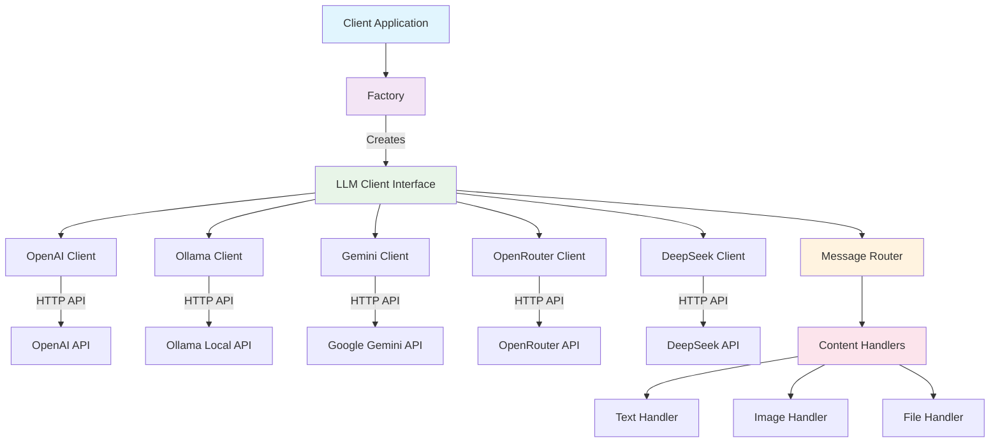

### Core Interfaces and Data Flow

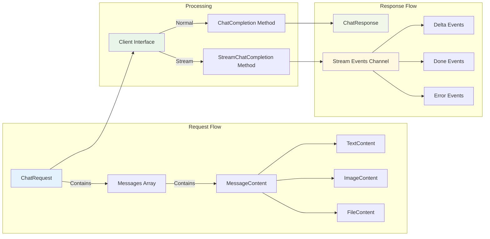

## Component Details

### 1. Client Interface

The `Client` interface is the core abstraction that all provider implementations must satisfy:

```go
type Client interface {
    ChatCompletion(ctx context.Context, req ChatRequest) (*ChatResponse, error)
    StreamChatCompletion(ctx context.Context, req ChatRequest) (<-chan StreamEvent, error)
    GetModelInfo() ModelInfo
    Close() error
}
```

**Key Features:**

- Context-aware operations with cancellation support
- Both synchronous and streaming response patterns
- Provider-agnostic request/response structures
- Resource cleanup through the `Close()` method

### 2. Factory Pattern

The `Factory` provides centralized client creation with configuration management.

### 3. Multimodal Content System

The library supports multimodal content through a type-safe interface system:

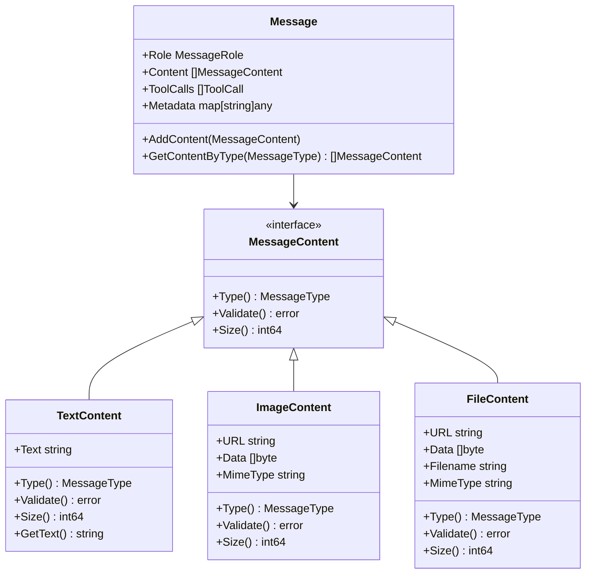

### 4. Streaming Architecture

The streaming architecture is a cornerstone of the go-llm library, designed to provide real-time, low-latency responses for interactive applications. The system uses a channel-based event-driven architecture that maintains thread safety while allowing for efficient resource management.

#### Core Streaming Components

The streaming system consists of several key components that work together to provide a seamless streaming experience:

1. **Stream Channel**: A buffered Go channel (`<-chan StreamEvent`) that delivers events asynchronously
2. **Event Types**: Standardized event structures for different phases of the streaming process
3. **Stream Processor**: Internal component that handles provider-specific parsing and normalization
4. **Context Management**: Full support for Go's context package for cancellation and timeouts

#### Streaming Flow Diagram

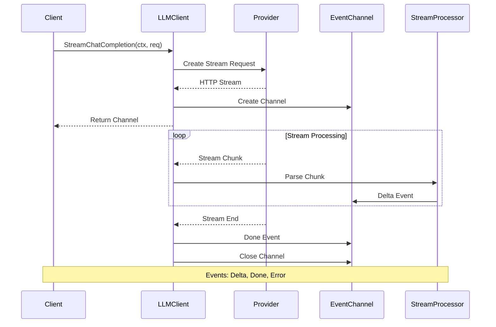

#### Stream Event Types and Structure

The streaming system uses three primary event types, each serving a specific purpose in the communication flow:

**Delta Events**: Incremental content updates

- Contain partial message content that gets accumulated by the client
- Support multimodal content (text, images, files) within a single stream
- Include tool call deltas for function calling scenarios
- Provide real-time updates as the LLM generates content

**Done Events**: Stream completion with finish reason

- Signal the end of the streaming response
- Include metadata about why the stream ended (`stop`, `length`, `tool_calls`, etc.)
- Provide final response statistics and usage information
- Trigger cleanup operations in the client

**Error Events**: Error handling and recovery

- Contain standardized error information across all providers
- Support retry logic and graceful degradation
- Include provider-specific error codes and messages
- Allow for partial response recovery in case of interruptions

#### Event Processing Architecture

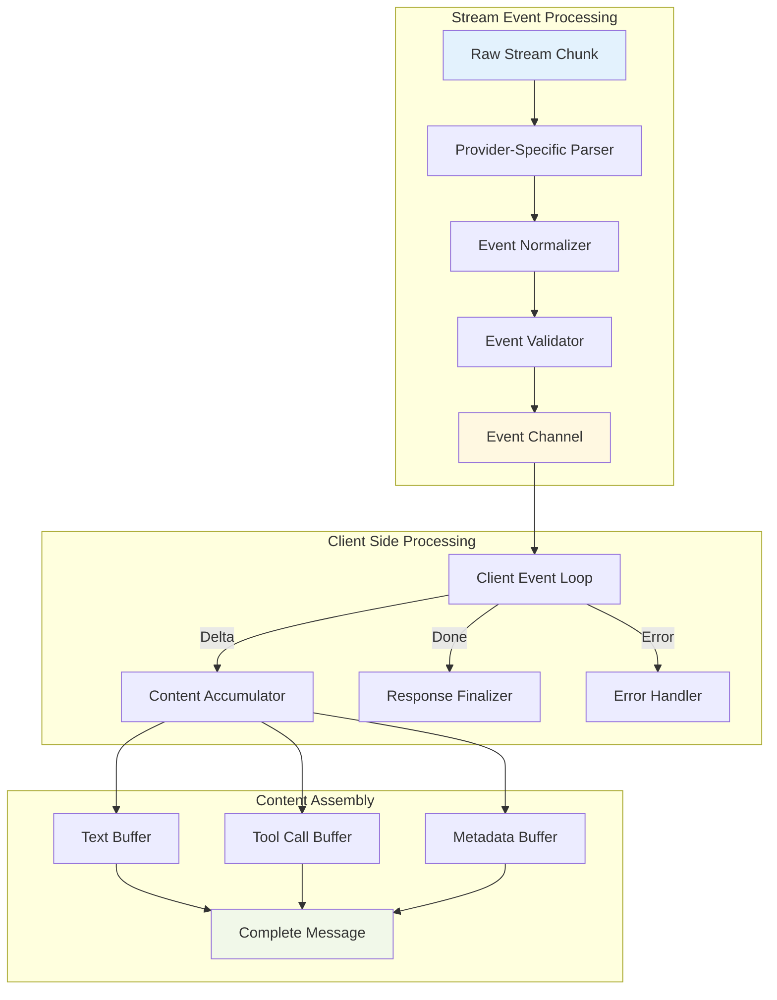

#### Buffering and Flow Control

The streaming architecture implements intelligent buffering to balance performance with memory usage:

- **Channel Buffering**: Event channels use a configurable buffer size (default: 10 events) to prevent blocking
- **Backpressure Handling**: Automatic flow control when clients can't keep up with the stream
- **Memory Management**: Incremental content assembly with configurable size limits
- **Timeout Management**: Context-based timeouts for both connection and individual chunks

#### Thread Safety and Concurrency

The streaming system is designed for safe concurrent usage:

- **Goroutine Safety**: Each stream runs in its own goroutine with proper cleanup
- **Channel Safety**: Go channels provide built-in synchronization for event delivery
- **Resource Cleanup**: Automatic cleanup of HTTP connections and goroutines on context cancellation
- **Provider Isolation**: Each provider's streaming implementation is isolated to prevent cross-contamination

#### Provider-Specific Adaptations

While the streaming interface is uniform, each provider requires specific handling:

**OpenAI Streaming**:

- Uses Server-Sent Events (SSE) format
- Handles both text and tool call streaming
- Supports vision model streaming for multimodal content

**Ollama Streaming**:

- Uses newline-delimited JSON format
- Handles local model response patterns
- Supports custom model streaming capabilities

**Gemini Streaming**:

- Uses Google's streaming protocol
- Handles safety filter events
- Supports multimodal streaming with safety checks

#### Error Recovery and Resilience

The streaming architecture includes comprehensive error handling:

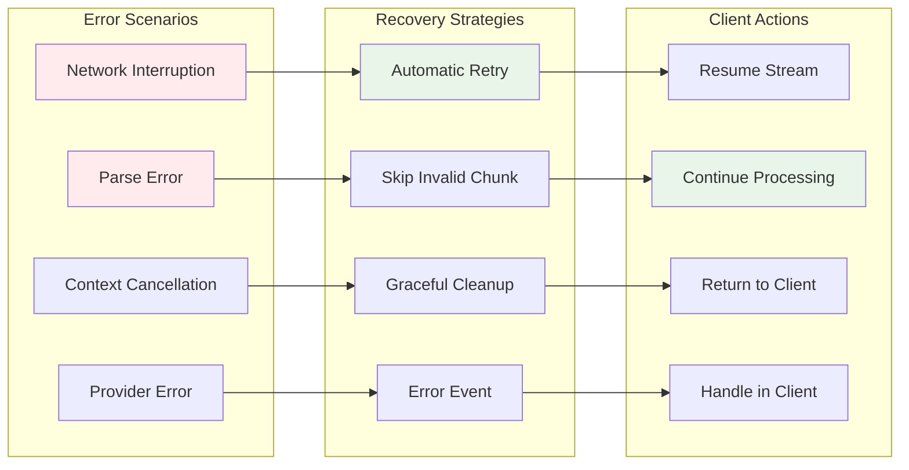

#### Performance Characteristics

The streaming architecture is optimized for performance:

- **Low Latency**: Events are delivered as soon as they're parsed, typically within milliseconds
- **Memory Efficient**: Incremental processing prevents large memory allocations
- **Scalable**: Can handle hundreds of concurrent streams with proper resource management
- **Responsive**: Context cancellation propagates immediately through the entire pipeline

### 5. Message Router System

The `MessageRouter` provides flexible content processing through a handler-based architecture:

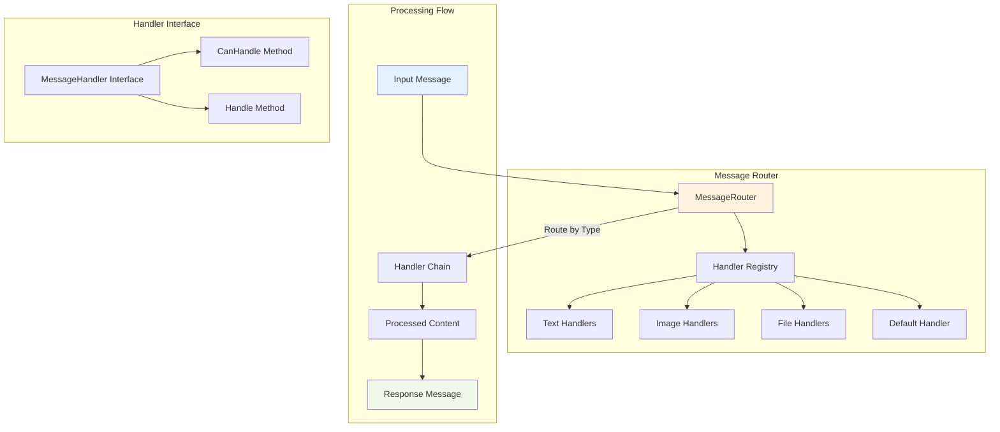

## ChatRequest Construction

Building `ChatRequest` objects is the primary way clients interact with the library:

### Basic Text Request

```go
request := llm.ChatRequest{
    Model: "gpt-4",
    Messages: []llm.Message{
        llm.NewTextMessage(llm.RoleUser, "Hello, how are you?"),
    },
    Temperature: &temperature, // *float32
    MaxTokens:   &maxTokens,   // *int
}
```

### Multimodal Request

```go
request := llm.ChatRequest{
    Model: "gpt-4-vision-preview",
    Messages: []llm.Message{
        {
            Role: llm.RoleUser,
            Content: []llm.MessageContent{
                llm.NewTextContent("What's in this image?"),
                llm.NewImageContentFromURL("https://example.com/image.jpg"),
            },
        },
    },
}
```

### Tool Calling Request

```go
request := llm.ChatRequest{
    Model: "gpt-4",
    Messages: []llm.Message{
        llm.NewTextMessage(llm.RoleUser, "What's the weather like?"),
    },
    Tools: []llm.Tool{
        {
            Type: "function",
            Function: llm.ToolFunction{
                Name:        "get_weather",
                Description: "Get weather information",
                Parameters: map[string]interface{}{
                    "type": "object",
                    "properties": map[string]interface{}{
                        "location": map[string]interface{}{
                            "type": "string",
                            "description": "City name",
                        },
                    },
                },
            },
        },
    },
}
```

## Streaming Support

### Event-Driven Streaming

The library provides comprehensive streaming support through an event-driven architecture:

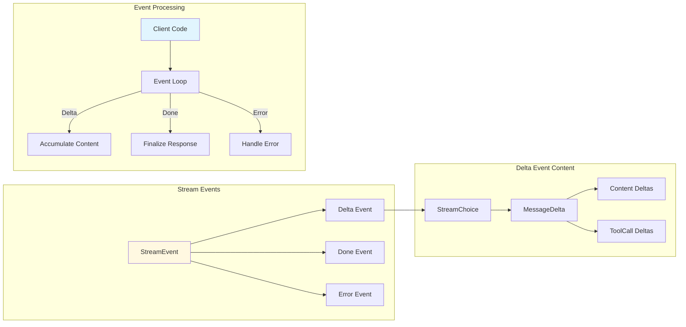

### Streaming Implementation Example

```go
stream, err := client.StreamChatCompletion(ctx, request)
if err != nil {
    return err
}

var fullResponse strings.Builder
for event := range stream {
    switch {
    case event.IsDelta():
        if len(event.Choice.Delta.Content) > 0 {
            if textContent, ok := event.Choice.Delta.Content[0].(*llm.TextContent); ok {
                fullResponse.WriteString(textContent.GetText())
                fmt.Print(textContent.GetText()) // Real-time output
            }
        }
    case event.IsDone():
        fmt.Println("\nStream complete:", event.Choice.FinishReason)
    case event.IsError():
        return fmt.Errorf("stream error: %v", event.Error)
    }
}
```

## Provider Integration

### Provider Implementation Pattern

Each provider follows a consistent implementation pattern:

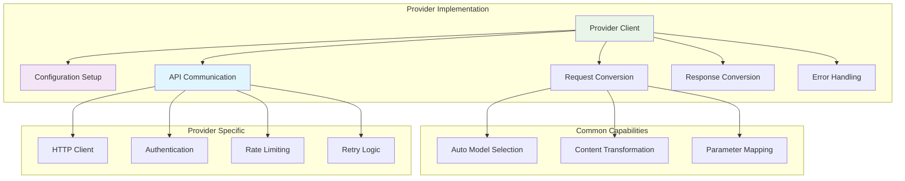

### Model Capability Registry

The library includes a comprehensive model registry that tracks capabilities:

```go
type ModelCapabilities struct {
    MaxTokens         int  `json:"max_tokens"`
    SupportsTools     bool `json:"supports_tools"`
    SupportsVision    bool `json:"supports_vision"`
    SupportsFiles     bool `json:"supports_files"`
    SupportsStreaming bool `json:"supports_streaming"`
}
```

## Security and Validation

### Content Validation Pipeline

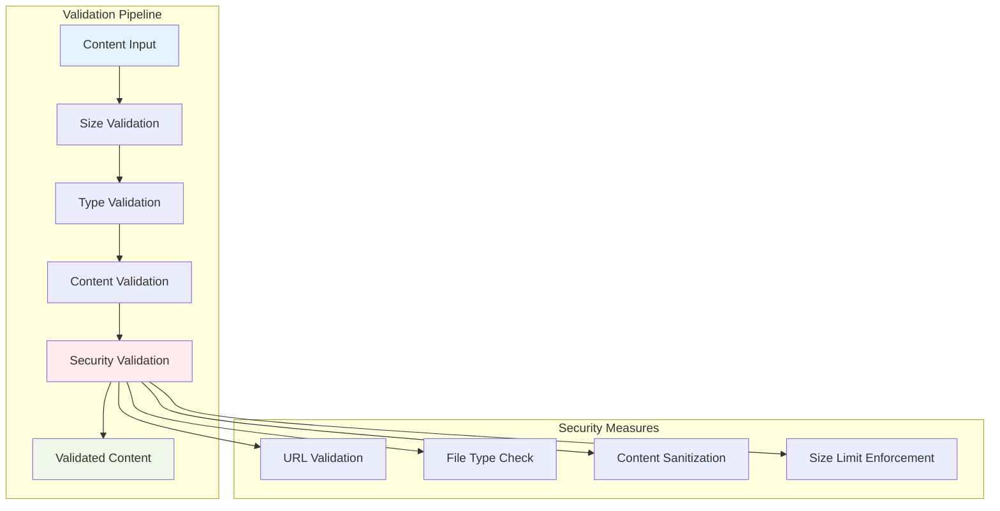

### Error Handling

The library provides standardized error handling across all providers:

```go
type Error struct {
    Code       string `json:"code"`
    Message    string `json:"message"`
    Type       string `json:"type"`
    StatusCode int    `json:"status_code,omitempty"`
}
```

## Performance Considerations

### Concurrency Model

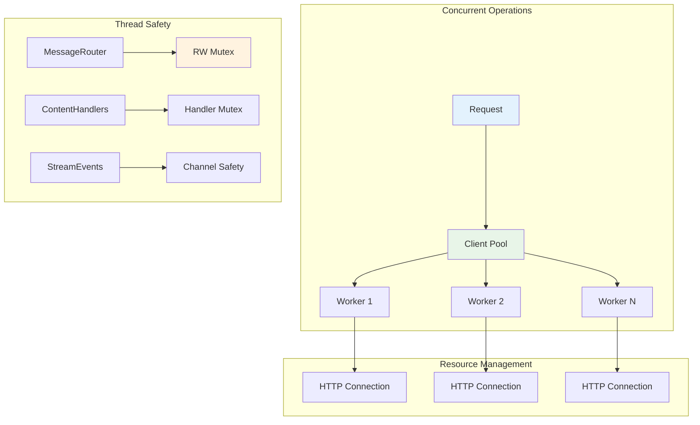

## Extension Points

### Custom Content Types

Developers can extend the system with custom content types:

```go
type CustomContent struct {
    Data []byte
    // Custom fields
}

func (c *CustomContent) Type() MessageType {
    return MessageType("custom")
}

func (c *CustomContent) Validate() error {
    // Custom validation logic
}

func (c *CustomContent) Size() int64 {
    return int64(len(c.Data))
}
```

### Custom Handlers

```go
handler := llm.NewTypedMessageHandler(
    llm.MessageTypeText,
    func(ctx context.Context, content llm.MessageContent) (llm.MessageContent, error) {
        // Custom processing logic
        return processedContent, nil
    },
)

router.RegisterHandler(llm.MessageTypeText, handler)
```

## Best Practices

### Request Construction

1. **Use appropriate models for content types** (vision models for images)
2. **Validate content before sending requests**
3. **Set reasonable timeouts and token limits**
4. **Handle errors gracefully with proper context**

### Streaming Usage

1. **Always handle all event types** (Delta, Done, Error)
2. **Implement proper cleanup** for channels and resources
3. **Use context for cancellation** in long-running streams
4. **Buffer content appropriately** for performance

### Provider Selection

1. **Choose providers based on specific needs** (local vs. cloud)
2. **Consider model capabilities** when building requests
3. **Implement fallback mechanisms** for critical applications
4. **Monitor usage and costs** for cloud providers

### Resource Management

1. **Always call Close()** on clients when done
2. **Use connection pooling** for high-throughput applications
3. **Implement proper retry logic** with exponential backoff
4. **Monitor memory usage** with large multimodal content

## Future Enhancements

The architecture is designed to support future enhancements:

- **Additional content types** (audio, video)
- **Custom provider implementations**
- **Advanced routing strategies**
- **Caching and persistence layers**
- **Metrics and observability**
- **Configuration management**

This architecture provides a solid foundation for building sophisticated LLM-powered applications while maintaining flexibility and extensibility.
